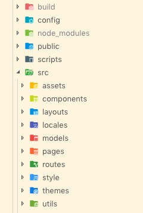

# 我们小而美的脚手架项目【基于React + MobX】
本项目由 [Create React App](https://github.com/facebook/create-react-app) 创建，已将相关配置eject，如后续有webpack相关需求，提出一起完善，希望我们前端项目走向规范化，工程化，同学们的编码风格逐渐趋于一致，所以借助这个项目，我们来谈谈我们要去共同遵循的项目规范.

## 🍑 项目相关脚本

在项目文件夹下, 你可以使用如下命令:

### `npm start`
本地开发环境启动APP。

打开浏览器，输入 [http://localhost:3000](http://localhost:3000) 以浏览。

支持热更新

### `npm run build`

将项目打包至`build`文件夹

该命令会基于production模式对项目打包，并优化相关打包以致达到最好的表现

打包文件会自动压缩并且文件名均作了hash处理，以便解决部署后出现的缓存问题

## 🥭 技术选型

本项目相关技术选型如下：
* 主框架：React
* 状态管理：MobX
* 打包工具：Webpack
* 样式：Less
* 国际化：React-intl
* UI框架：Antd
* 接口：fetch（已经无感，已做通用封装，在规范约定中详细说明）

## 🍎 项目架构

src 外部文件没有什么需要重点说的，主要看src内。

**assets** 项目中所使用的资源(包括通用样式、字体、图片等资源)；

**components** 项目中的通用组件封装，这个点后面想沉淀出我们自己的一套业务组件，妈妈再也不用担心我要到处复制；

**layouts** 项目特定路由对应的基本布局，怎么理解，就是披着羊皮的狼的那个羊皮，某个功能的外壳，也可以理解为某功能的入口文件，用于定义外层基本表现（例：header、footer等）

**locales** 项目国际化配置文件，支持分文件处理

**models** 项目公共store，注意：设置公共store需谨慎，三思而后行，尽量减少公共store的传递

**pages** 业务页面代码

**routes** 项目路由配置，只需在router.config.js中按约定配置即可，routerResolver.js是为路由解析文件，与业务无关，后期会以构建脚手架形式，将这类代码封装透明化

**themes** 主体样式配置文件 ❌

**utils** 项目相关工具类处理，request、request-context后期均会透明化，这两个文件即是我们接口规范封装的核心

## 🍉 项目规范约定

🍌 项目特定依赖必须详细注明版本号！尤其node与npm版本；

🍅 package.json 里的包版本号必须写死！！！除非因某个包有了新需求特性，再去手动更新；

🍇 业务组件中若不是通用的，放置于pages对应页面业务文件夹下，首字母大写；

🎃 各模块下维护私有store，并且命名为 **store-xxx.js**；

🥒 各模块下独自维护请求通信文件，统一命名 **io.js**，若后续存在拆文件需求，再迭代之；

🌶 通用组件保证单一职责且易于组合或拓展，无副作用（无请求等异步操作）

🍐 判断等号 === 和不等 !==

🍉 样式配置，千万不要暴力更改，在src/assets/antd/variable.less中通过变量覆盖，现已实现在线antd换肤 🌰🌰🌰

## 🍐 我们的计划

✅ 项目骨架与规范

✅ 国际化支持

✅ 接口定义标准，基于io-context接口配置

✅ 配置式路由

基于Less换肤

前端PM2独立部署

项目脚手架开发

视觉规范，输出通用组件

## 🍇 更新说明
1. 支持接口请求手动取消 [08-13] io.getContent.abort()，实例见src/pages/Home/Home